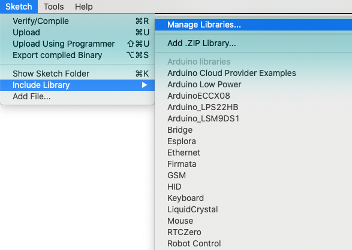
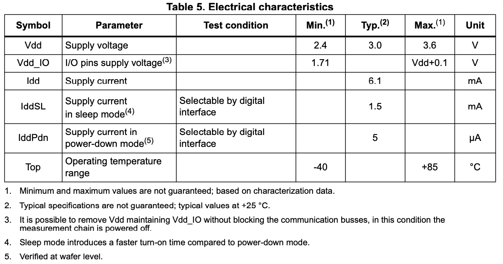

| <center></center>  |  | [](https://github.com/RAKWireless/RAK12025-I3G4250D/actions) | <center></center> |
| -- | -- | -- | -- |

# Library for WisBlock Sensor RAK12025 I3G4250D 3-axis gyroscope

This library is used with the RAK12025 gyroscope sensor modules.    
This library provides easy to use functions to setup the RAKwireless gyroscope sensor modules and read the sensor data. The I3G4250D is a low-power 3-axis angular rate sensor with unprecedented stability at zero-rate level and sensitivity over temperature and time. It includes a sensing element and an IC interface capable of providing the measured angular rate to the application through an I2C-compatible interface. The I3G4250D has a selectable full scale (±245 / ±500 / ±2000 dps) and is capable of measuring rates with a user-selectable bandwidth. The I3G4250D can operate within a temperature range of -40 °C to +85 °C.  

* **[WisBlock Gyroscope Sensor RAK12025](https://store.rakwireless.com/products/)**

See the `I3G4250D_SCALE` enum for reference:

```c
typedef enum I3G4250D_SCALE {
  I3G4250D_SCALE_245 = ((uint8_t)0x00),
  I3G4250D_SCALE_500 = ((uint8_t)0x40),
  I3G4250D_SCALE_2000 = ((uint8_t)0x80),
  I3G4250D_SCALE_2000_2 = ((uint8_t)0xC0),
} I3G4250D_SCALE;
```

The default I2C address is `0x68` / `0b1101000`, defined as `I3G4250D_I2C_ADDR`.

# Documentation

* [*RAKwireless RAK12025 Gyroscope sensor*](https://docs.rakwireless.com/Product-Categories/WisBlock/RAK12025/Overview/)
* [Library Repository](https://github.com/RAKWireless/RAK12025-I3G4250D) - Product repository for the RAK12025 Sensor Modules.

## Installation

### Arduino IDE

In Arduino IDE open `Sketch->Include Library->Manage Libraries` then search for RAK12025.




You can also install it manually:

* Method 1: download the archive, unzip it and place the RAK12025-I3G4250D folder into the library directory.

* Method 2: In the terminal, if you have git installed, go to the libraries folder and do:

```bash
git clone https://github.com/RAKWireless/RAK12025-I3G4250D
```

You should get an output similar to this:

```bash
Cloning into 'RAK12025-I3G4250D'...
remote: Enumerating objects: 20, done.
remote: Counting objects: 100% (20/20), done.
remote: Compressing objects: 100% (15/15), done.
remote: Total 20 (delta 0), reused 14 (delta 0), pack-reused 0
Receiving objects: 100% (20/20), 263.40 KiB | 500.00 KiB/s, done.
```

### PlatformIO

In PlatformIO, open PlatformIO Home, switch to libraries and search for RAK12025. Or install the library project dependencies by adding the following into `platformio.ini`:

```
lib_deps =
  rakwireless/RAKwireless I3G4250D Gyroscope
```

You can also install it manually:

Download the archive, unzip it and place the RAK12025-I3G4250D folder into the library directory: in PlatformIO this is usually in `<user/.platformio/lib>`.

# Usage

The library provides an I3G4250D class, which allows to setup and read values from the RAK12025. Checkout the examples for further details.    

## BASICS

The module uses `WB_IO2` to power up and is conflicting with INT1, so it's better to use it in Slot C and Slot D. So you turn on the module with:

```c
  pinMode(WB_IO2, OUTPUT);
  digitalWrite(WB_IO2, HIGH);
```

Then, initializing the module is simple enough. Given a `I3G4250D` object called `i3g4240d`, all you have to do is this:

```c
  if (false == i3g4240d.I3G4250D_Init(Wire, I3G4250D_I2C_ADDR)) {
    Serial.println("I3G4250D init fail.");
  }
  i3g4240d.I3G4250D_SetScale(I3G4250D_SCALE_500);
  id = i3g4240d.I3G4250D_GetID();
  Serial.print("Gyroscope Device ID = ");
  Serial.println(id, HEX);
```

Finally you can poll the module in `loop()`, giving it time after each poll:

```c
void loop() {
  i3g4240d_data = i3g4240d.I3G4250D_GetScaledData();
  Serial.println();
  Serial.print("Gyroscope X(dps) = ");
  Serial.println(i3g4240d_data.x);
  Serial.print("Gyroscope Y(dps) = ");
  Serial.println(i3g4240d_data.y);
  Serial.print("Gyroscope Z(dps) = ");
  Serial.println(i3g4240d_data.z);
  delay(1000);
}
```

`i3g4240d_data` is an object of class `I3G4250D_DataScaled`, initialized like this:

```c
I3G4250D_DataScaled i3g4240d_data = {0};
```

See the [whole code](examples/RAK12025_I3G4250D_Gyroscope/RAK12025_I3G4250D_Gyroscope.ino) for a complete example.

## INTERRUPTS

Instead of polling, you can let the module tell you when there was movement. The [Gyroscope Interrupt example](examples/RAK12025_I3G4250D_Gyroscope_Interrupt/RAK12025_I3G4250D_Gyroscope_Interrupt.ino) shows you how. On top of the init code above, you need to set up the interrupts: you have six options to choose from, X/Y/Z - Low or High.

```c
  /* The value of 1 LSB of the threshold corresponds to ~7.5 mdps
     Set Threshold ~100 dps on X, Y and Z axis
  */
  i3g4240d.I3G4250D_SetTresholds(0x1415, 0x1415, 0x1415);
  /* INT1 interrupt configuration. If not open, default is disabled.
     I3G4250D_INT_CTR_XLI_ON: Enable interrupt generation on X low event.
     I3G4250D_INT_CTR_XHI_ON: Enable interrupt generation on X high event.
     I3G4250D_INT_CTR_YLI_ON: Enable interrupt generation on Y low event.
     I3G4250D_INT_CTR_YHI_ON: Enable interrupt generation on Y high event.
     I3G4250D_INT_CTR_ZLI_ON: Enable interrupt generation on Z low event.
     I3G4250D_INT_CTR_ZHI_ON: Enable interrupt generation on Z high event.
  */
  i3g4240d.I3G4250D_InterruptCtrl(I3G4250D_INT_CTR_XHI_ON | I3G4250D_INT_CTR_YHI_ON | I3G4250D_INT_CTR_ZHI_ON);
  i3g4240d.I3G4250D_Enable_INT1();
  pinMode(INT1, INPUT); // Connect with I3G4250D INT1.
  attachInterrupt(digitalPinToInterrupt(INT1), INT1CallBack, RISING);
```

Once you've defined the events and attached the interrupt to a callback, you can set a semaphore (`volatile boolean g_threshold_exceeded = false;` for instance. Note it has to be `volatile` because of the ISR), which can be read and reset in `loop()`.

```c
void INT1CallBack() {
  g_threshold_exceeded = true;
  //detachInterrupt(digitalPinToInterrupt(INT1)); // Disable INT.
}
```

## Power-Down and Low-Power

The library has a `I3G4250D_EnterLowPower()` function that turns down the module. Meanwhile, there's a `I3G4250D_Mode(I3G4250D_MODE mode)` command that accepts 3 modes: power-down, sleep and normal:

```c
typedef enum I3G4250D_MODE {
  I3G4250D_POWER_DOWN,
  I3G4250D_POWER_SLEEP,
  I3G4250D_POWER_NORMAL,
} I3G4250D_MODE;
```

From the datasheet:



## This class provides the following methods:

**I3G4250D();**     
Constructor for RAK12025 interface.    

**uint8_t I3G4250D_Init(uint8_t reg1, uint8_t reg2,  uint8_t reg3, uint8_t reg4, uint8_t reg5, I3G4250D_SCALE scale);**    
Init the I3G4250D device.

Parameters:    

| Direction | Name      | Function | 
| --------- | ----      | -------- |
| in        | addr      | I2C address of the ADC121C021  | 
| in        | &theWire  | I2C interface to be used  | 
| return    |           | If the initialization succeeds return true else return false  | 

**void setVoltageResolution(float value);**    
Set the resolution voltage

Parameters:    

| Direction | Name      | Function | 
| --------- | ----      | -------- |
| in        | value      | if use 5V supply for MQx sensor to set value 5.0 if use 3.3V supply for MQx sensor to set value 3.3   | 

**float getVoltageResolution();**     
Gets the resolution voltage configuration. 

Parameters:    

| Direction | Name      | Function | 
| --------- | ----      | -------- |
| return        |       | the value of the resolution voltage configuration    | 

**void setR0(float R0 = 10);**    
Set the resistance R0 of the sensor at a known concentration without the presence of other gases, or in fresh air.

Parameters:    

| Direction | Name      | Function | 
| --------- | ----      | -------- |
| in        | R0      | the resistance of the sensor at fresh air.   | 

**float getR0();**    
Gets the R0 parameter. 

Parameters:    

| Direction | Name      | Function | 
| --------- | ----      | -------- |
| return        |       | R0 in kOhm    | 

**void setRL(float RL = 10);**    
Set the resistance RL of the sensor at a known concentration without the presence of other gases, or in fresh air.

Parameters:    

| Direction | Name      | Function | 
| --------- | ----      | -------- |
| in        | RL      | the resistance of the sensor at fresh air.   | 

**float getRL();**     
Gets the RL parameter. 

Parameters:    

| Direction | Name      | Function | 
| --------- | ----      | -------- |
| return        |       | RL in kOhm    | 

**void setA(float K);**     
Set the slope of the line

Parameters:    

| Direction | Name      | Function | 
| --------- | ----      | -------- |
| in        | K      | the slope of the line configuration   | 

**float getA();**    
Get the slope of the line parameter

Parameters:    

| Direction | Name      | Function | 
| --------- | ----      | -------- |
| return        |       | the slope of the line configuration    | 

**void setB(float b);**    
Set config Y intercept parameter

Parameters:    

| Direction | Name      | Function | 
| --------- | ----      | -------- |
| in        | b      | Y intercept   | 

**float getB();**     
Get the Y intercept parameter configuration 

Parameters:    

| Direction | Name      | Function | 
| --------- | ----      | -------- |
| return        |       | Y intercept parameter | 

## User functions
**float getSensorVoltage();**
Gets the voltage of sensor output.

Parameters:    

| Direction | Name      | Function | 
| --------- | ----      | -------- |
| return        |       | voltage V | 

**float calibrateR0(float ratioInCleanAir);**    
Set the ratio of RS/R0 in clean air

Parameters:    

| Direction | Name      | Function | 
| --------- | ----      | -------- |
| in        | ratioInCleanAir | ratioInCleanAir = RS/R0 | 
| return        |       | R0 MQx sensor resistance in the clean air  | 

**void setRegressionMethod(uint8_t method);**     
Set the regression method 

Parameters:    

| Direction | Name      | Function | 
| --------- | ----      | -------- |
| in        | method      | set the regression method if=1 use Exponential else Linear Exponential: PPM = A*(RS/R0)^B Linear: PPM = pow(10, (log10(RS/R0)-B)/A)   | 

**uint8_t getRegressionMethod();**    
Gets the regression method

Parameters:    

| Direction | Name      | Function | 
| --------- | ----      | -------- |
| return        |       | the regression method | 

**float readSensor();**    
Read the MQx sensor data to PPM 

Parameters:    

| Direction | Name      | Function | 
| --------- | ----      | -------- |
| return        |       | MQx sensor data PPM | 

## Direct ADC functions
**uint8_t readConfigRegister();**    
Read the Configuration Register data, the register address is 0x02.    

Parameters:    

| Direction | Name      | Function | 
| --------- | ----      | -------- |
| return    |           | Configuration Register data  | 

**uint8_t readAlertStatus();**    
Get the current status of the alert flag If the flag is set, the low or high alert indicators are set as appropriate. 

Parameters:    

| Direction | Name      | Function | 
| --------- | ----      | -------- |
| return    |           | alert status  | 

**uint8_t readAlertLowStatus();**     
Get the current status of the Lower Range Alert Flag. `readAlertStatus()` must be called to update this value. 

Parameters:    

| Direction | Name      | Function | 
| --------- | ----      | -------- |
| return    |           | Lower Range Alert Flag status  | 

**uint8_t readAlertHighStatus();**    
Get the current status of the Over Range Alert Flag. `readAlertStatus()` must be called to update this value.

Parameters:    

| Direction | Name      | Function | 
| --------- | ----      | -------- |
| return    |           | Higher Range Alert Flag status  | 

**void clearAlertStatus();**    
Clears the alert low and alert high flags. 

Parameters:    

| Direction | Name      | Function | 
| --------- | ----      | -------- |
|     |           |   | 

**void configCycleTime(uint8_t cycletime);**    
Sets the Configuration Register of Cycle Time bits value,when the value set to zeros, the automatic conversion mode is disabled. This is the case at power-up. 

Parameters:    

| Direction | Name      | Function | 
| --------- | ----      | -------- |
| in        | cycletime      | the conversion intervals of convert time can be 0-7 value Conversion Interval Typical fconvert (ksps) 0 Automatic Mode Disabled 0 1 Tconvert x 32 27 2 Tconvert x 64 13.5 3 Tconvert x 128 6.7 4 Tconvert x 256 3.4 5 Tconvert x 512 1.7 6 Tconvert x 1024 0.9 7 Tconvert x 2048 0.4  | 

**uint8_t readCycleTime();**     
Read the Configuration Register of Cycle Time bits value. 

Parameters:    

| Direction | Name      | Function | 
| --------- | ----      | -------- |
| return        |       | the Cycle Time bits value from the Configuration Register  | 

**void configAlertHold(configType alertHold);**     
Sets the Alert Hold bit enable or disable. 

Parameters:    

| Direction | Name      | Function | 
| --------- | ----      | -------- |
| in        | alertHold | Enable:enable alert hold, Disable:disable alert hold.  | 

**uint8_t readAlertHold();**    
Get the Alert Hold bit status from the Configuration Register 

Parameters:    

| Direction | Name      | Function | 
| --------- | ----      | -------- |
| return        |       | the value of the Alert Hold bit   | 

**void configAlertFlag(configType alertflag);**     
Config the Alert Flag Enable bit,This controls the alert status bit [D15] in the Conversion Result register.    

Parameters:    

| Direction | Name      | Function | 
| --------- | ----      | -------- |
| in        | alertflag | Enable or Disable.    | 

**uint8_t readAlertFlag();**    
Get the bit value of Alert Flag Enable Status from the Configuration Register

Parameters:    

| Direction | Name      | Function | 
| --------- | ----      | -------- |
| return        |  | the bit value of Alert Flag Enable    | 

**void configAlertPin(configType alertpin);**    
Config the alert pin output enable or disable when ALERT come.

Parameters:    

| Direction | Name      | Function | 
| --------- | ----      | -------- |
| in        | alertpin | Enable or Disable     | 

**uint8_t readAlertPin();**    
Get the Alert Pin Enable Status from the Configuration Register.

Parameters:    

| Direction | Name      | Function | 
| --------- | ----      | -------- |
| return        |  | the Alert Pin Enable Status register value    | 

**void configPolarity(polarityType polarity);**     
Config the alert pin output level polarity when ALERT come. 

Parameters:    

| Direction | Name      | Function | 
| --------- | ----      | -------- |
| in        | polarity | High or Low      | 

**uint8_t readPolarity();**     
Get the alert pin output level polarity configuration.

Parameters:    

| Direction | Name      | Function | 
| --------- | ----      | -------- |
| return        |  | the polarity configuration      | 

**void setAlertLowThreshold(uint16_t threshold);**     
Sets the lower limit threshold value. 

Parameters:    

| Direction | Name      | Function | 
| --------- | ----      | -------- |
| in        | threshold | threshold value      | 

**uint16_t readAlertLowThreshold();**    
Get the value of the lower limit threshold value configuration

Parameters:    

| Direction | Name      | Function | 
| --------- | ----      | -------- |
| return        |  | the lower limit threshold value      | 

**void setAlertHighThreshold(uint16_t threshold);**    
Sets the upper limit threshold value.

Parameters:    

| Direction | Name      | Function | 
| --------- | ----      | -------- |
| in        | threshold | the upper limit threshold value      | 

**uint16_t readAlertHighThreshold();**      
Get the value of the upper limit threshold value configuration 

Parameters:    

| Direction | Name      | Function | 
| --------- | ----      | -------- |
| return        |  | the upper limit threshold value      | 

**void setHysteresis(uint16_t hysteresis);**     
Config the hysteresis value

Parameters:    

| Direction | Name      | Function | 
| --------- | ----      | -------- |
| in        | hysteresis | hysteresis value      | 

**uint16_t readHysteresis();**     
Get the hysteresis value configuration 

Parameters:    

| Direction | Name      | Function | 
| --------- | ----      | -------- |
| return        |  | the hysteresis value configuration       | 

**uint16_t readLowestConversion();**      
Gets the Lowest Conversion result recorded from the Lowest Conversion Register.

Parameters:    

| Direction | Name      | Function | 
| --------- | ----      | -------- |
| return        |  |  the lowest conversion result value | 

**void clearLowestConversion();**    
Clears the Lowest Conversion register value. 

**uint16_t readHighestConversion();**    
Gets the Highest Conversion result recorded from the Highest Conversion Register. 

Parameters:    

| Direction | Name      | Function | 
| --------- | ----      | -------- |
| return        |  |  the highest conversion result value | 

**void clearHighestConversion();**     
Clears the Highest Conversion register value. 

**uint16_t getAdcValue();**    
Read the ADC conversation value from the Conversion Register. 

Parameters:    

| Direction | Name      | Function | 
| --------- | ----      | -------- |
| return        |  |  ADC conversation result | 

